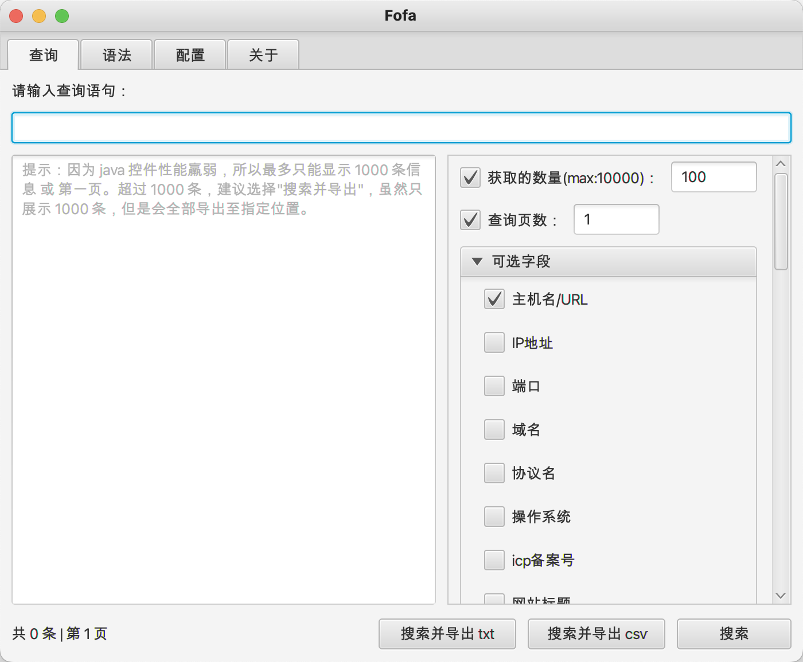
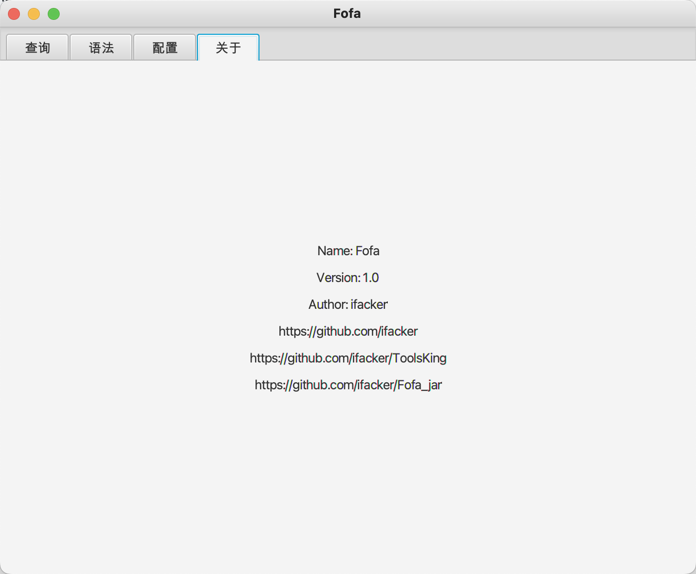

# 插件开发手册  
  
---   
⚠️ 本程序是使用 jdk1.8 开发  
⚠️ ToolsKing-1.0.jar 为启动器，后续我还会去开发一些插件，放进插件商店中，大家如果有兴趣，写的插件，可以联系我，添加进插件商店中  

## 主程序界面


## 创建主函数入口的包名
开发插件的主目录应在 plugins 下，命名目录为程序的名称，如下图：
  

## 修改 pom 文件
在之后编译的时候，需要修改 pom.xml 文件中的包名，如下图：
  

## 开发主函数
开发主函数的时候，如下图，有两个函数
 
分别为：`getName` 和 `getContent`
### getName
主要放置插件标签页内的名称 'title' 
### getContent
主要放置后续开发的主程序的代码

## 开发注意事项⚠️
在开发 http 这类网络 🛜 请求的时候，推荐使用 okhttp3,如下图：

本程序内置了代理，包含 http/socks5，所以如果需要发起网络请求，推荐使用如下代码：
```java
        // 创建 client 
        OkHttpClient client = new ProxyInternet().newClient();

        // 创建 HTTP 请求
        Request request = new Request.Builder()
        .url("https://www.baidu.com")
        .build();

        Response response = null;
        try {
        // 发送请求
        response = client.newCall(request).execute();
        // 处理响应
        System.out.println(response.body().string());

        } catch (IOException e) {
        e.printStackTrace();
        }
```
使用这个代码创建的请求，会自动跟随主程序设置的代理进行请求

--- 
最后，如果有不明白的，可以提 issues